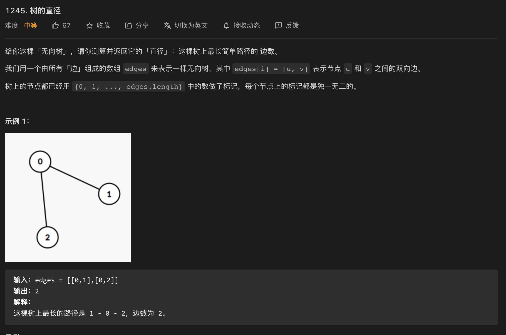
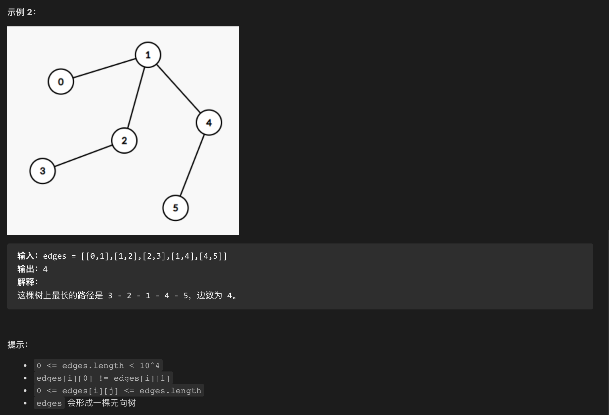

本周作业
----------
1. [从中序与后序遍历序列构造二叉树（Medium）](https://leetcode-cn.com/problems/construct-binary-tree-from-inorder-and-postorder-traversal/)

    * [作业代码](./homework/lc106_construct_binary_tree_from_inorder_and_postorder_traversal.go)

2. [课程表 II （Medium）](https://leetcode-cn.com/problems/course-schedule-ii/)

    * [作业代码](./homework/lc210_course_schedule_ii.go)

3. [被围绕的区域（Medium）](https://leetcode-cn.com/problems/surrounded-regions/)

    * [作业代码](./homework/cl130_surrounded_regions.go)


课上例题
----------
1. [二叉树的中序遍历（Easy）](https://leetcode-cn.com/problems/binary-tree-inorder-traversal/submissions/)

    * [练习代码](./lessons/lc94_binary_tree_inorder_traversal.go)

2. [N 叉树的前序遍历（Easy）](https://leetcode-cn.com/problems/n-ary-tree-preorder-traversal/)

    * [练习代码](./lessons/lc589_n_ary_tree_preorder_traversal.go)

3. [N 叉树的层序遍历（Medium）](https://leetcode-cn.com/problems/n-ary-tree-level-order-traversal/)

    * [练习代码](./lessons/lc429_n_ary_tree_level_order_traversal.go)
    
4. [二叉树的序列化与反序列化（Hard）](https://leetcode-cn.com/problems/serialize-and-deserialize-binary-tree/)    
    * [练习代码](./lessons/lc297_serialize_and_deserializ_binary_tree.go)

5. [从前序与中序遍历序列构造二叉树（Medium）](https://leetcode-cn.com/problems/construct-binary-tree-from-preorder-and-inorder-traversal/)
    
    * [练习代码](./lessons/lc105_construct_binary_tree_from_preorder_and_inorder_traversal.go)

6. [树的直径（此题为 LeetCode 会员题选做）](https://leetcode-cn.com/problems/tree-diameter/)

    * 题目
    
    
    
    
    * [练习代码](./lessons/lc1245_tree_diameter.go)
    
7. [二叉树的最近公共祖先（Medium）](https://leetcode-cn.com/problems/lowest-common-ancestor-of-a-binary-tree/)

    * [练习代码](./lessons/lc236_lowest_common_ancestor_of_a_binary_tree.go)

8. [冗余连接（Medium）](https://leetcode-cn.com/problems/redundant-connection/description/)

    * [练习代码](./lessons/lc684_redundant_connection.go)

9. [课程表（Medium）](https://leetcode-cn.com/problems/course-schedule/)

    * [练习代码](./lessons/lc207_course_schedule.go)

10. [电话号码的字母组合（Medium）](https://leetcode-cn.com/problems/letter-combinations-of-a-phone-number/)

    * [练习代码](./lessons/lc17_letter_combinations_of_a_phone_number.go)

11. [ N 皇后（Hard）](https://leetcode-cn.com/problems/n-queens/)

    * [练习代码](./lessons/lc51_n_queens.go)

12. [岛屿数量（Medium）](https://leetcode-cn.com/problems/number-of-islands/)

    * [练习代码](./lessons/lc200_number_of_islands.go)

-----------------------------------

二叉树
--------
Binary Tree

* 完全二叉树: 最后一层叶子节点靠左

* 满二叉树: 最后一层叶子节点是满的

* 树节点定义

    ```go
    type TreeNode struct {
        val int
        left, right *TreeNode
    }
    ```

* 二叉树的遍历
    > 先(前中后)序遍历是深度优先, 层序遍历是广度优先 

    + 前序遍历(Pre-Order): 根->左->右
    
    + 中序遍历(In-Order): 左->根->右
    
    + 后序遍历(Post-Order): 左->右->根
    
    * 层序遍历: 广度优先


从前序与中序遍历序列构造二叉树
-------------------------
```go
func buildTree(preorder []int, inorder []int) *TreeNode {
	if len(preorder) == 0 {
		return nil
	}

	var build func(preorder []int, inorder []int, l1, r1, l2, r2 int) *TreeNode

	// [l1, r1) [l2, r2)
	build = func(preorder []int, inorder []int, l1, r1, l2, r2 int) *TreeNode {
		if l1 >= r1 {
			return nil
		}

		root := &TreeNode{
			Val: preorder[l1],
		}

		mid := l2
		for inorder[mid] != root.Val {
			mid++
		}

		leftSize := mid - l2

		root.Left = build(preorder, inorder, l1+1, l1+1+leftSize, l2, mid)
		root.Right = build(preorder, inorder, l1+1+leftSize, r1, mid+1, r2)

		return root
	}

	return build(preorder, inorder, 0, len(preorder), 0, len(inorder))
}
```


链表、树、图的关系
---------------

* 链表是特殊的树

* 树是特殊的图

    + N 个点 N - 1 条边的连通无向图(树)
    
    + N 个点 N 条边的连通无向图(基环树)


图的存储
-------

* 邻接矩阵

* 出边数组

* 邻接表(出边数组链表化)


图的深度优先遍历
----------------

* 时间复杂度: O(n + m)

* DFS 找环(lc684)

    ```go
    func findRedundantConnection(input [][]int) []int {
        var addEdge func(x, y int)
        var dfs func(x, fa int)
    
        n := len(input)
        
        edges := make([][]int, n + 1)
        visit := make([]bool, n + 1)
        hasCycle := false
    
        addEdge = func(x, y int) {
            edges[x] = append(edges[x], y)
        }
    
        dfs = func(x, fa int) {
            // 第一步: 标记已访问
            visit[x] = true
    
            // 第二步: 遍历所有出边
            for _, y := range edges[x] {
                if y == fa {
                    continue
                }
    
                if visit[y] {
                    hasCycle = true
                } else {
                    dfs(y, x)
                }
            }
    
            visit[x] = false
        }
    
        // 加边
        for _, edge := range input {
            u, v := edge[0], edge[1]
    
            //  无向图看做是双向边的有向图
            addEdge(u, v)
            addEdge(v, u)
    
            // 每加一条边就判断是否有环
            dfs(u, -1)
            if hasCycle {
                return edge
            }
        }
    
        return nil
    }
    ```

图的广度优先遍历
----------------

* 关键点: 队列、visited 数组

* 应用: 求图的最大层数


状态与状态空间
----------------

#### 状态
> 程序维护的所有动态数据构成的集合

* 题面中涉及的所有数学信息

* 函数访问的所有变量

* 例: 计票问题中的名字出现的次数
    
    ```go
    // 只需要关注变化的数据 i, count
    for i := 0; i < n; i++ {
        count[names[i]]++
    }
    ```

#### 状态空间
> 所有可能状态构成的结合

#### 解题思路

* 提取所有信息

* 变化的作为状态

* 状态简化：把可以由其他数据决定的信息排除


搜索
------
搜索就是直接遍历整个状态空间的算法

* 状态空间是图而不是树时，需要判重(记忆化)


DFS vs BFS
------------

* DFS 更适合搜索树形状态空间

* BSF 适合求“最小代价”、“最小步数” 

* 状态空间为一般图时(需要判重)，DFS 和 BFS 差不多
